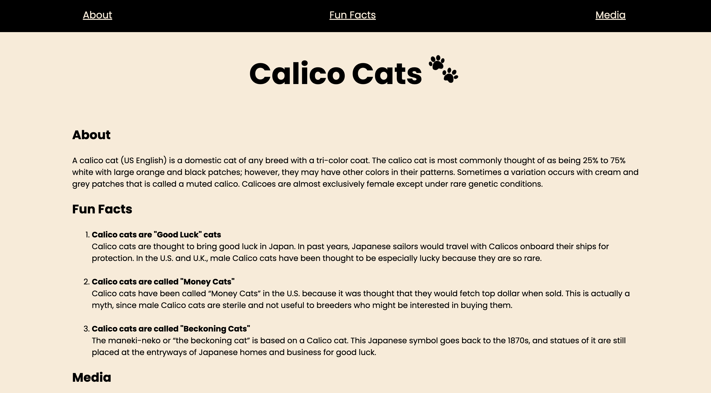
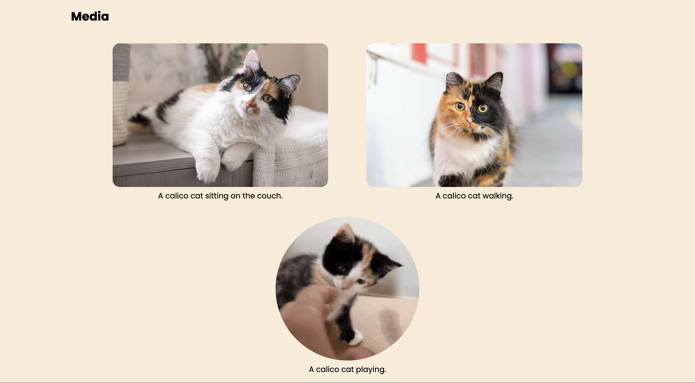

# GDSC Website Workshop Wednesday - Calico Cats Blog

## About
This is a project demonstrating HTML/CSS in Google Developer Student Club's Website Wednesday Workshop, at University of the Pacific on 9/27/2023.
In this workshop, I walked through the fundamentals of creating web pages using HTML/CSS to our members, and guiding them to create their own blogs.

## Prerequisites

Before diving into web development, make sure you have the following:
1. Visual Studio Code: We recommend using Visual Studio Code as your code editor.
2. Live Server Extension: For real-time previews of your web pages. I recommend Google Chrome.

## What is HTML?
HTML stands for Hyper Text Markup Language. It is the foundation of web development. HTML documents are composed of HTML elements, each having three parts:

1. Start tag: Opening tag that defines the beginning of an element.
2. Content: The content enclosed within the tags.
3. End tag: Closing tag that defines the end of an element.

### HTML Structure
HTML documents have a structured layout that includes elements like:

- header: For the logo, site title, or navigation menu.
- nav: To include navigation links to different sections of the website.
- main: For the primary content of the webpage.
- footer: To include contact info, copyright info, and social media links.
- article: For holding contents such as blogs and articles.
- figure: Used for images, videos, and illustrations.
- div: A general container to group elements together.
You'll also encounter simple tags like p (paragraph), h1 (header), a (hyperlink), and img (image).

### Simple Tags
a - Hyperlink Tag
The a tag is used to embed links. It has an href attribute that defines the link's destination. For example:

img - Image Tag
The img tag is used to embed images into web pages. It has attributes like src (source) and alt (alternate text for accessibility). Always include alt for accessibility.

## Cascading Style Sheets (CSS)
CSS (Cascading Style Sheets) is used for styling and presentation of web content. It complements HTML, which provides the structure of web pages.

### What is CSS?
CSS uses rules to define how HTML elements should be displayed. A CSS rule consists of:

*Selector:* The element you want to style.

Declaration Block: Contains styling rules separated by semicolons.

Declaration: A name-value pair declaring a style.

*Class Selector:* To select elements with a specific class, use a period (.) followed by the class name.

*Id Selector:* To select elements with a specific id, use a hash (#) followed by the id name.

### Text Styling
CSS allows you to style text elements with properties like *color* (text color), *font-family* (font selection), *font-size* (text size), *font-style* (italic or normal), and *font-weight* (text boldness).

*Text Layout:* You can control text alignment with the text-align property, which can have values like center, left, right, or justify.

Now, it's time to add styling to your animal blog! Practice what you've learned by applying CSS to your HTML structure.

### Share Your Creation
Congratulations! Share your animal blog with others and continue to explore the exciting world of web development.

Happy coding! 🚀